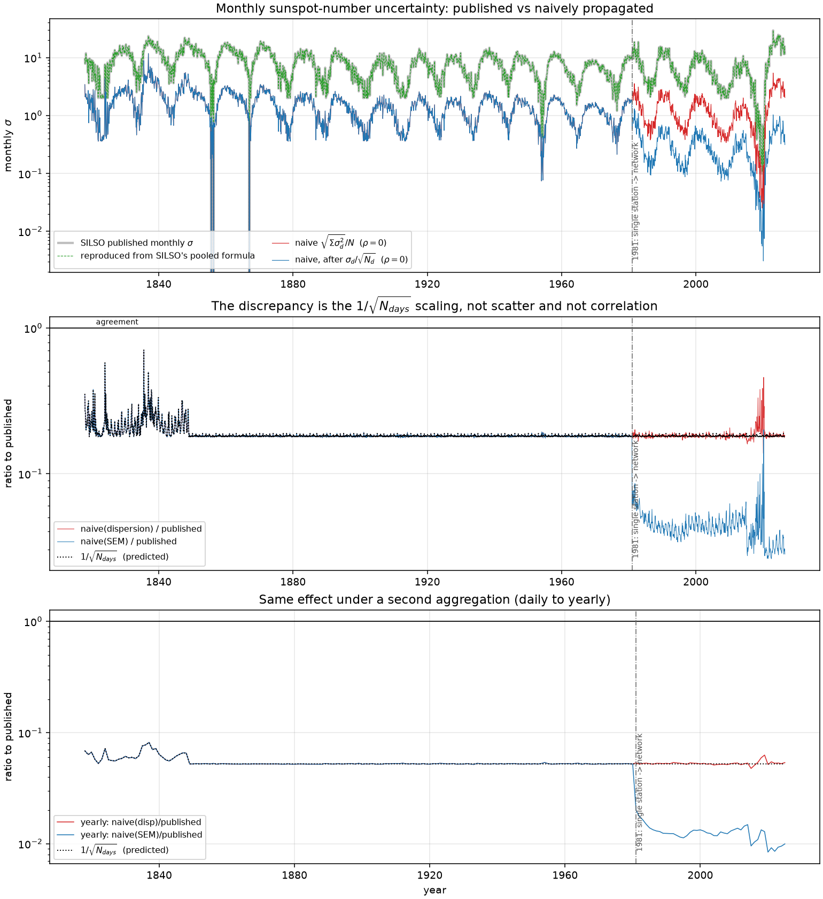

# SILSO sunspot number reader with a first-class uncertainty channel

A prototype exploring what it would take for `sunpy.timeseries.GenericTimeSeries`
to represent measurement uncertainty, tested against the SILSO version 2 sunspot
number: a real, long, well documented dataset that ships uncertainty alongside
every value.

Context: [sunpy issue #8750](https://github.com/sunpy/sunpy/issues/8750).

This is not a pull request and contains no sunpy fork or PR scaffolding. It is
a standalone artifact built to turn a design question ("should `GenericTimeSeries`
carry uncertainty, and how?") into an empirical one ("here is what breaks if it
does not").

---

## The result in short

SILSO publishes a daily sunspot number with a daily sigma, and separately
publishes monthly and yearly means with their own sigma. That makes it possible to
check a propagation rule against a published answer.

Propagating the daily sigma to a monthly sigma by the usual independent quadrature
rule does **not** reproduce SILSO's published monthly sigma. It is too small by a
factor of about 5.5, with a ratio of 0.1815, which is almost exactly
1 / sqrt(N_days).

The interesting part is why. The obvious explanation is correlation: daily counts
share observers, so the errors are not independent, and assuming independence
understates the result. **That explanation is wrong here, and the data rules it
out.** The correlation coefficient required to reconcile the two numbers comes out
**greater than 1**, which is impossible, for 97.9% of months. No correlation
structure of any kind can close the gap.

The actual cause is that the two numbers do not estimate the same quantity.
SILSO's published monthly sigma is a pooled measure of how much individual
observing stations disagree within the month. The quadrature formula computes the
standard error of the monthly mean. The first does not shrink as you add days; the
second does. The factor of sqrt(N_days) is the signature of exactly that mismatch.

So the design conclusion holds, and for a stronger reason than expected. "Just add
an uncertainty column" is insufficient, because before you can choose a
correlation assumption you first have to record what the sigma column is an
estimate of. A bare column cannot express that, so any resampling built on one
is unfalsifiable: it produces a plausible number under either reading and gives
you no way to tell which one you got.



---

## Quick start

```bash
python -m venv .venv && source .venv/bin/activate
pip install -r requirements.txt
```

```bash
python scripts/verify_data.py        # verify file structure against the bytes
python scripts/quadrature_check.py   # the propagation experiment and the figure
python scripts/api_audit.py          # the API preservation audit
pytest -q                            # 13 regression tests locking the findings
```

Each script prints its findings and writes raw output to `output/`.

Downloads are cached in `~/.silso_cache` (override with the `SILSO_CACHE`
environment variable). A SHA-256 and a retrieval timestamp are recorded per file,
because SILSO's URLs are stable but their contents are not, so every number here
can be tied to a specific byte level snapshot.

### Library use

```python
from silso_uncertainty import load, UncertainTimeSeries, INDEPENDENT, FULLY_CORRELATED

# The baseline: sigma is an ordinary, untyped column, which is what sunpy
# supports today.
ts = load("daily_total")

# The prototype: sigma is typed uncertainty with a recorded estimand.
u = UncertainTimeSeries.from_silso("daily_total")

u.resample("MS")                              # ValueError: needs explicit correlation
u.resample("MS", correlation=INDEPENDENT)     # ValueError: still a station dispersion

sem = u.as_standard_error()                   # the documented sigma / sqrt(N) step
lo = sem.resample("MS", correlation=INDEPENDENT)       # rho = 0
hi = sem.resample("MS", correlation=FULLY_CORRELATED)  # rho = 1, about sqrt(N) larger
```

Both refusals are deliberate. They convert a factor of 5.5 error into an
exception at the call site.

---

## 1. The dataset

Everything in this section was verified by reading the files, not the info pages.
Regenerate with `python scripts/verify_data.py`; raw output in
[`output/verify_data.txt`](output/verify_data.txt).

All files were retrieved from `https://www.sidc.be/SILSO/DATA/` on 2026-08-13.

| file | bytes | rows | fields | SHA-256 (first 12) |
|---|---:|---:|---:|---|
| `SN_d_tot_V2.0.csv` (daily total) | 2,894,954 | 76,183 | 8 | `b3ea957e8673` |
| `SN_d_hem_V2.0.csv` (daily hemispheric) | 846,277 | 12,631 | 14 | `05a7472e822e` |
| `SN_m_tot_V2.0.csv` (monthly mean) | 126,578 | 3,331 | 7 | `a78640e2e0c9` |
| `SN_ms_tot_V2.0.csv` (13-month smoothed) | 126,578 | 3,331 | 7 | `1289e5922889` |
| `SN_y_tot_V2.0.csv` (yearly mean) | 9,454 | 326 | 5 | `0ccb2104b03f` |

All files are semicolon delimited, with no header row, no quoting, a fixed field
count per file, and values space padded for alignment.

### 1.1 Column layouts

**Daily total**, 8 fields: year, month, day, fraction of year, sunspot number
(range -1 to 528), standard deviation (-1 to 77.7), number of observations
(0 to 69), definitive/provisional flag.

**Daily hemispheric**, 14 fields: year, month, day, fraction of year, then **all
three values** (total, north, south), then **all three sigmas**, then **all three
counts**, then the flag. The grouping is by quantity, not by hemisphere, which is
easy to mis-parse.

**Monthly and smoothed**, 7 fields: year, month, fraction of year, value, sigma,
number of observations, flag. No day column.

**Yearly**, 5 fields: fraction of year (mid-year, e.g. `1700.5`), value, sigma,
number of observations, flag. **There are no year/month/day columns at all**, so
the fractional year is the only date information in this file.

### 1.2 Date encoding

The fractional year column exists alongside year/month/day, as expected. It
carries 3 decimal places, about 0.4 day of resolution, which is not enough to
recover a calendar date unambiguously. The reader therefore builds its index from
the integer year/month/day columns and keeps the fractional year only as a
passthrough column. For the yearly file there is no choice, since the fractional
year is all there is.

### 1.3 Missing values: three conventions, not one

`-1` is the missing value sentinel, and it is distinct from zero.
**11,398 days have a real sunspot number of exactly 0.** Conflating the two erases
every solar minimum in the record.

The important correction is that the value column and the sigma column **do not
fail together in every file**:

| file | value = -1 and sigma = -1 | value = -1 only | **sigma = -1 with a valid value** |
|---|---:|---:|---:|
| daily total | 3,247 | 0 | **0** |
| monthly total | 0 | 0 | **828** |

- In the **daily total** file the two columns always fail together. There is not a
  single day with a valid value and a missing sigma.
- In the **monthly** file the opposite holds. 828 months have a perfectly valid
  mean but sigma = -1. These are every month before 1818-01, because the monthly
  sigma is computed from daily data and the daily record starts in 1818.
- In the **hemispheric** file there are no missing values or sigmas at all. `-1`
  appears only in the two hemispheric station count columns, on 8,401 rows, all
  before 2015-01-01, on rows whose values are perfectly valid.
- In the **13-month smoothed** file the value is -1 on exactly 12 rows: the first
  six months of 1749 and the last six available months, which are the plus/minus
  six month edges of the filter.

A reader that masks the columns jointly invents 828 months of monthly sigma and
silently discards 8,401 rows of valid hemispheric data. **The columns must be
masked independently.** This reader does that.

One further trap: in the daily file the observation count column uses **0**, not
-1, to mark "no observation". Three different conventions coexist across these
files.

### 1.4 What the sigma column actually is

SILSO documents the daily column as the standard deviation of the input sunspot
numbers from individual stations, and states separately that the standard error of
the daily value is `sigma / sqrt(N)`. So the published number is the **raw
dispersion across stations**, and it is **not** pre-divided by sqrt(N).

This was confirmed independently from the files themselves. SILSO documents the
monthly sigma as:

```
sigma(m) = sqrt( SUM(N_d * sigma_d^2) / SUM(N_d) )
```

Applying that to the daily file reproduces the published monthly sigma for
**2,502 of 2,502 months, 100.00%, with a maximum absolute difference of 0.0500**,
which is exactly the rounding precision of the published file. The same holds for
the yearly file: 208 of 208 years, maximum difference 0.0499.

That is a complete verification, and it establishes the central fact of this
repository: **the published monthly sigma is an observation-weighted pooled
dispersion of station scatter, not a standard error of the monthly mean.** It does
not shrink as more days are averaged together.

**A caveat found in the data rather than the docs.** 56,288 days have
`n_observations = 1`, and **96.5% of them still carry a non-zero sigma**. A
dispersion across a single station would be identically zero. The explanation is
in SILSO's documentation: before 1981 the count is fixed at 1 by convention,
because data came essentially from Zürich. So on those days the sigma is a
carried-over or modelled uncertainty, not an empirical spread. The first day with
more than one station is **exactly 1981-01-01**. Any per-station reading of sigma
is only meaningful from 1981 onward.

### 1.5 Relationships between the products

Both verified numerically:

- Monthly `n_observations` **equals the sum of daily `n_observations`**, for
  100.00% of months. It counts observations, not stations.
- The monthly mean **equals the plain arithmetic mean of the daily values** to
  file rounding for 99.40% of months, consistent with SILSO describing it as a
  simple arithmetic mean.

### 1.6 Provisional flag and URL stability

The final column is `1` for definitive and `0` for provisional. In the current
snapshot 122 daily rows are provisional, covering 2026-04-01 through 2026-07-31, a
four month rolling window consistent with the documented three to six months.

URLs take the form `https://www.sidc.be/SILSO/DATA/SN_d_tot_V2.0.csv`. The `V2.0`
refers to the **sunspot number version** (the 2015 recalibration), not to a file
revision. There is no per-release versioning in the path: the same URL always
serves the current file, and its content changes as provisional values become
definitive. **The URL is stable and the content is not**, which is why `fetch.py`
records a checksum and timestamp for every download.

### 1.7 What was not verified

Stated explicitly, since the point of this section is to separate the two:

- Whether a future `V2.1` or `V3.0` path will exist, or how it would be named.
  Only current URLs were tested.
- Any server side caching, rate limiting, or mirror policy. Each file was fetched
  a handful of times. Nothing about sustained access was tested.
- The provenance of sigma before 1981 beyond what the docs say. That single
  station days carry non-zero sigma is verified; how those values were derived is
  not something these files can answer.
- The 13-month smoothed sigma formula. The smoothed value follows the standard
  SILSO 13-month filter, but the smoothed sigma column was not reproduced from
  first principles, so its exact definition is unconfirmed. The yearly file is
  used as the second aggregation instead, where the formula was verified.
- The 0.60% of months where the monthly mean does not match the arithmetic mean of
  the daily values to within 0.05. Not investigated, and assumed to be rounding.

---

## 2. The design question

sunpy's `GenericTimeSeries` has no concept of uncertainty. A source that ships one,
like SILSO, has to put it in an ordinary column, where nothing distinguishes it
from a second measurement. The question is where uncertainty should live instead.

### 2.1 What the ecosystem already does

Surveyed against astropy 8.0.1, sunpy 8.0.0, pandas 3.0.3.

| | uncertainty | typed | correlation aware | survives operations | has a time index |
|---|---|---|---|---|---|
| `astropy.nddata` | attribute | yes | **yes, required** | n/a | no |
| `specutils.Spectrum1D` | attribute | yes | inherited | yes | spectral |
| `ndcube.NDCube` | attribute | yes | inherited | **yes** | WCS |
| `astropy.timeseries.TimeSeries` | none | no | no | n/a | yes |
| `pandas` | none | no | no | no | yes |
| **`sunpy.GenericTimeSeries`** | **none** | no | no | n/a | yes |

**`astropy.nddata`** stores uncertainty as a typed attribute on the container, and
the type carries the semantics: `StdDevUncertainty`, `VarianceUncertainty`,
`InverseVariance`, `UnknownUncertainty`, and now `Covariance`. The detail that
decided this prototype's design is the propagation signature:

```python
NDUncertainty.propagate(self, operation, other_nddata, result_data, correlation, axis=None)
```

`correlation` is a **required positional argument**, and each class exposes a
`supports_correlated` flag. Astropy did not give it a default. Together with the
recent addition of a full `Covariance` class, this is the ecosystem having already
reached the conclusion that section 3 reaches empirically: propagation without a
stated correlation is not well defined.

**`specutils`** confirms the attribute pattern scales to a real domain object with
its own axis. **`ndcube`** is the most relevant precedent, because it slices
`uncertainty` alongside `data`, so the model survives operations that return new
objects. That is exactly what section 4 finds `GenericTimeSeries` cannot do, and
sunpy already depends on ndcube, so it is in-family rather than an outside import.

**`astropy.timeseries.TimeSeries`** is the closest match in shape, a `QTable`
subclass where columns are `Quantity`, so units are first class but uncertainty is
not (`hasattr(TimeSeries, "uncertainty")` is `False`). The idiomatic approach there
is an extra column. That is informative: sunpy cannot simply delegate this.

**`pandas`** offers nothing. No units, no uncertainty, no column metadata that
survives operations (`DataFrame.attrs` is best effort and is dropped by most
reductions). Since `GenericTimeSeries` stores its data in a `DataFrame`, anything
sunpy wants here it has to hold itself.

### 2.2 The decision

**Uncertainty belongs as a typed attribute keyed by column, not as a column and
not as a parallel object.**

1. **A plain column is silently wrong under aggregation.** It survives every
   operation, and it gets averaged like data the moment anything reduces rows.
   Section 3 measures the resulting error at a factor of about 5.5. Failure that
   is both silent and plausible is the worst kind.
2. **A parallel object desynchronises.** Truncating one and not the other is an
   unenforceable invariant, and nothing raises when it is violated.
3. **A typed attribute carries its own semantics** and cannot be mistaken for data
   by a row-reducing operation, because it is not in the table.
4. **It matches precedent already inside sunpy's dependency tree**, so it is
   defensible in review without inventing a new concept.

Keyed **by column** rather than one per object, because `GenericTimeSeries` is
inherently multi-column; the hemispheric file alone has three values each with its
own sigma. This mirrors how sunpy already stores `units` as a column to unit dict,
which is the smallest change that fits the existing object.

### 2.3 The one addition beyond astropy's model

Astropy records the uncertainty's **type** (standard deviation, variance, inverse
variance) but not its **estimand**, meaning what quantity it is an uncertainty of.
SILSO forces that distinction, because its daily sigma is a dispersion across
observing stations while a resample needs a standard error of a mean, and the two
differ by sqrt(N).

So `UncertainTimeSeries` carries an `estimand` dict alongside `uncertainty`, with
values `"station_dispersion"` or `"standard_error"`, and:

- `as_standard_error()` performs the documented sigma / sqrt(N) conversion and
  relabels the estimand;
- `resample()` **refuses** to run on a `station_dispersion`, and **refuses** to run
  without an explicit `correlation`.

---

## 3. The experiment

Regenerate with `python scripts/quadrature_check.py`. Raw output in
[`output/quadrature_check.txt`](output/quadrature_check.txt), per-month data in
[`output/monthly_comparison.csv`](output/monthly_comparison.csv).

2,502 months compared, 1818-01 to 2026-07. Two structural cross-checks confirm the
daily and monthly files describe the same rows: the summed observation counts match
for 100.00% of months, and SILSO's pooled formula reproduces the published sigma
for 100.00% of months. The second is the key control, because it means we know
exactly what the published number is before comparing anything to it.

Two variants of the naive formula are tested, because the choice between them is
itself the design decision under examination:

| variant | formula | what it assumes |
|---|---|---|
| `naive_disp` | sqrt(sum sigma_d^2) / N | sigma_d is already an uncertainty on the daily value, which is the formula as usually written |
| `naive_sem` | sqrt(sum sigma_d^2 / N_d) / N | sigma_d is a station dispersion, converted to a standard error first per SILSO's documented sigma / sqrt(N) |

### 3.1 The ratio to the published sigma

| quantity | n | median | mean | 5% | 95% |
|---|---:|---:|---:|---:|---:|
| naive (raw dispersions, rho = 0) | 2,499 | **0.1815** | 0.1885 | 0.1779 | 0.2300 |
| naive (converted to standard error, rho = 0) | 2,499 | **0.1802** | 0.1577 | 0.0378 | 0.2288 |
| **1 / sqrt(N_days), predicted** | 2,502 | **0.1796** | 0.1877 | 0.1796 | 0.2294 |

The naive result tracks 1 / sqrt(N_days) across every statistic, including both
tails. The correlation of the ratio with 1 / sqrt(N_days) is 0.9268. This is a
clean scaling mismatch, not scatter.

### 3.2 The implied correlation is impossible

Solving for the equicorrelation rho that would make naive quadrature reproduce the
published value, using

```
Var(mean) = [ (1 - rho) * sum(s_i^2) + rho * (sum s_i)^2 ] / N^2
```

| starting from | median rho | 5% | 95% | **fraction inside [-1, 1]** |
|---|---:|---:|---:|---:|
| raw dispersions | **1.0829** | 1.0086 | 1.6231 | **2.09%** |
| standard errors | **1.1026** | 1.0093 | 33.1611 | **1.89%** |

A rho above 1 is not a strong correlation, it is not a correlation at all. For 98%
of months the published sigma lies outside the range reachable by any correlation
model, including perfect correlation.

That the median sits *just* above 1 is itself explanatory. The rho = 1 limit of the
naive formula is the arithmetic mean of the daily sigmas, while SILSO's pooled
formula is their weighted quadratic mean, which is larger by Jensen's inequality.
So **SILSO's published monthly sigma is essentially the fully correlated limit of
the naive formula**, a hair above it, for a reason that is pure algebra.

That gives the cleanest framing of the design problem:

> The naive independent formula and SILSO's published value are the rho = 0 and
> rho = 1 endpoints of the same expression, separated by a factor of
> sqrt(N_days), about 5.5. Both are defensible outputs of "resample a series that
> has a sigma column". Nothing in a bare column distinguishes them.

### 3.3 The effect is stable and is not solar

Correlation of the ratio with candidate drivers:

| driver | correlation |
|---|---:|
| smoothed sunspot number (solar cycle phase) | **0.0490** |
| monthly mean sunspot number | 0.0523 |
| mean stations per day | **-0.0263** |
| **days in month** | **-0.8336** |

Only the number of days matters. Cycle phase and station count are both
uncorrelated with the discrepancy, so this is not a physical effect that varies
with solar activity. It is arithmetic.

By 25 year era the ratio is flat from 1850 onward:

| era | n | median | IQR |
|---|---:|---:|---|
| 1800-1824 | 83 | 0.2085 | [0.1896, 0.2318] |
| 1825-1849 | 300 | 0.2124 | [0.1909, 0.2420] |
| 1850-1874 | 300 | 0.1803 | [0.1795, 0.1825] |
| 1875-1899 | 300 | 0.1806 | [0.1794, 0.1826] |
| 1900-1924 | 300 | 0.1805 | [0.1793, 0.1827] |
| 1925-1949 | 300 | 0.1804 | [0.1795, 0.1825] |
| 1950-1974 | 300 | 0.1806 | [0.1794, 0.1826] |
| 1975-1999 | 300 | 0.1812 | [0.1792, 0.1838] |
| 2000-2024 | 300 | 0.1815 | [0.1789, 0.1860] |

The early elevation is coverage, not physics. Before about 1850 many months have
fewer than 31 observed days, so 1 / sqrt(N_days) is larger. The IQR narrows sharply
once coverage becomes complete.

### 3.4 A second aggregation confirms it

Daily to yearly, 208 years, 1818 to 2025. The pooled formula reproduces the
published yearly sigma for 100.00% of years.

| quantity | median ratio |
|---|---:|
| naive (raw dispersions, rho = 0) | **0.0525** |
| naive (converted to standard error, rho = 0) | 0.0523 |
| **1 / sqrt(N_days), predicted** | **0.0523** |

1 / sqrt(365) = 0.0523. The prediction holds to three decimal places under an
aggregation 12 times coarser, and the implied rho is inside [-1, 1] for **0.00%**
of years. The effect is not an artifact of monthly resampling.

### 3.5 Reading the figure

[`figures/quadrature_check.png`](figures/quadrature_check.png)

- **Top**: the published sigma (grey) with the reproduced pooled formula (green
  dashed) lying exactly on top of it across two centuries, while both naive
  variants sit a factor of about 5.5 below. The red and blue curves coincide
  before 1981 and separate after, because `n_observations` is pinned at 1 until
  1981-01-01, making the sigma to standard error conversion a no-op. The single
  station to network transition shows up directly in the propagation.
- **Middle**: the ratio against the 1 / sqrt(N_days) prediction (dotted). The naive
  curve sits on the prediction for the whole record. After 1981 the standard error
  variant drops a further sqrt(N_stations), ending about 30 times below published.
- **Bottom**: the same picture for daily to yearly, at a ratio near 0.052.

### 3.6 Limitations of this experiment

- **The true correlation between daily values was not measured, and cannot be from
  these files.** That would need the per-station reports behind each daily number,
  which SILSO does not publish in these products. The rho values here are a
  reconciliation diagnostic, meaning "what would rho have to be", not an estimate
  of physical correlation. Their exceeding 1 is evidence about estimands, not
  about observers.
- Because of that, this analysis **does not show that daily counts are
  uncorrelated**. They very likely are correlated, through shared observers. It
  shows that correlation is not what separates these two published numbers.
- All ratios are bounded below by the published file's 0.05 rounding, visible as
  quantisation in low sigma months, but far too small to affect any conclusion.

---

## 4. What survives a `GenericTimeSeries` operation

Regenerate with `python scripts/api_audit.py`. Raw output in
[`output/api_audit.txt`](output/api_audit.txt).

Tested against **sunpy 8.0.0** installed from PyPI into a clean virtualenv.

For every public operation that returns a new series, the audit checks whether the
subclass, the units dict, the meta, and a typed uncertainty attribute survive. The
last one is a proxy for any state a subclass adds.

### 4.1 Baseline: `GenericTimeSeries`

| operation | subclass | units | meta | uncertainty | note |
|---|---|---|---|---|---|
| `truncate` | yes | yes | yes | n/a | |
| `concatenate` | yes | yes | yes | n/a | |
| `concatenate(same_source=True)` | yes | yes | yes | n/a | |
| `sort_index` | yes | yes | yes | n/a | |
| `add_column` | yes | yes | yes | n/a | |
| `remove_column` | yes | yes | yes | n/a | |
| `extract` | yes | yes | yes | n/a | |
| `resample` | n/a | n/a | n/a | n/a | **`AttributeError`, the method does not exist** |

The baseline is clean. Note that "subclass: yes" is trivially true here, since the
class *is* `GenericTimeSeries`, which is exactly why the defect below stays
invisible until you subclass.

### 4.2 The prototype: `UncertainTimeSeries`

| operation | subclass | units | meta | uncertainty | note |
|---|---|---|---|---|---|
| `truncate` | yes | yes | yes | **NO** | |
| `concatenate` | yes | yes | yes | **NO** | |
| `concatenate(same_source=True)` | yes | yes | yes | **NO** | |
| `sort_index` | **NO** | yes | yes | **NO** | downcast to `GenericTimeSeries` |
| `add_column` | yes | yes | yes | **NO** | |
| `remove_column` | yes | yes | yes | **NO** | |
| `extract` | **NO** | yes | yes | **NO** | downcast to `GenericTimeSeries` |
| `resample` | n/a | n/a | n/a | n/a | prototype's own method, refuses without a correlation |

### 4.3 The pattern

It is systematic, and it is one coherent issue rather than several small bugfixes,
though not quite in the way you might expect from the `sort_index` case alone.

1. **`units` and `meta` are preserved by every operation tested.** Those are not
   broken.
2. **Subclass preservation is inconsistent.** Four of six operations preserve it;
   `sort_index` and `extract` do not.
3. **The stronger finding is that extra subclass state is lost by six of six
   operations, including the four that correctly preserve the subclass.** Fixing
   the two downcasts would not fix this.

The cause is one design choice repeated at every call site in
`sunpy/timeseries/timeseriesbase.py`:

| operation | construction | subclass safe |
|---|---|---|
| `add_column` | `self.__class__(data, meta, units)` | yes |
| `remove_column` | `self.__class__(data, deepcopy(meta), units)` | yes |
| `truncate` | `self.__class__(data.sort_index(), meta, copy(units))` | yes |
| `concatenate` | `self.__class__(...)` if all operands share a class, else `GenericTimeSeries(...)` | conditional |
| `sort_index` | `GenericTimeSeries(...)`, hardcoded | **no** |
| `extract` | `GenericTimeSeries(...)`, hardcoded | **no** |

Every one of them calls the three argument constructor positionally, and there is
**no `_new_instance` or `_replace` hook** for a subclass to override. So a subclass
can survive as a *type* while arriving with all of its own state reset to
defaults, which is worse than downcasting because it fails silently rather than
loudly.

One correction to a natural assumption: `concatenate`'s downcast is **not**
switched on the `same_source` argument. The real test is
`all(self.__class__ == series.__class__ for series in others)`; `same_source` only
gates an earlier `TypeError` guard. That is why both `concatenate` rows preserve
the subclass above. The downcast fires only when concatenating mixed classes,
which is defensible behaviour, but the argument name suggests it controls
something it does not.

### 4.4 Why this makes uncertainty one issue rather than a feature request

Section 3 showed that a resample of an uncertain series must be told a correlation
assumption and must know what the sigma column estimates. Both of those are state
that lives on the series and is not a data column. Section 4 shows sunpy currently
has no way to carry such state through a single operation.

That joins the two halves of the argument:

- Add uncertainty as **a plain column** and it survives every operation, and is
  silently wrong the moment anything reduces rows. Section 3 puts the error at a
  factor of about 5.5.
- Add uncertainty as **typed state** and it is semantically correct and is erased
  by all six row-returning operations.

So the issue is not "add an uncertainty column". It is:

> `GenericTimeSeries` has no extension point for per-series state. Until it has
> one, uncertainty can be either correct or persistent, but not both.

That is a single, testable, self-contained defect, and it is a prerequisite for
any uncertainty design rather than a competing proposal.

### 4.5 A minimal fix, not implemented here

Add one overridable constructor hook and route all call sites through it:

```python
def _new_instance(self, data, meta=None, units=None, **kwargs):
    """Construct a new instance of this class, preserving subclass state."""
    return type(self)(data, meta, units, **kwargs)
```

Subclasses override it to forward their own state. Independently, `sort_index` and
`extract` should use it rather than hardcoding `GenericTimeSeries`, and
`concatenate`'s conditional should be reconciled with the other four.

### 4.6 On `resample`

`resample` does not exist on `GenericTimeSeries` in sunpy 8.0.0, and does not
exist on the 8.1 development branch either (`grep -n "def resample"` finds nothing
in `sunpy/timeseries/`). Resampling today means dropping to `to_dataframe()`, which
leaves the sunpy object model entirely, taking units, meta, and any uncertainty
with it.

That is an opportunity rather than a problem. If `resample` is added later, section
3 is the argument for what its signature has to include, and requiring a
correlation from the start avoids a breaking change afterwards.

---

## Repository layout

```
silso_uncertainty/
  fetch.py       download and cache, with checksum and timestamp provenance
  reader.py      parsers, with per-column sentinel handling
  baseline.py    sigma as an ordinary column, the honest baseline
  uncertain.py   sigma as typed uncertainty, plus correlation models
scripts/
  verify_data.py        structural verification against the bytes
  quadrature_check.py   the propagation experiment and the figure
  api_audit.py          the API preservation audit
tests/           13 regression tests locking the findings above
output/          raw generated output from the scripts
figures/
```

## Environment

Results were produced with sunpy 8.0.0 from PyPI, astropy 8.0.1, pandas 3.0.3,
numpy 2.5.0, matplotlib 3.11.0, on Python 3.13.

If your machine has a development checkout of sunpy installed in editable mode,
the audit will measure that instead of a release. Use the virtualenv.

## Data attribution

Sunspot Number version 2.0, WDC-SILSO, Royal Observatory of Belgium, Brussels.
Licensed CC BY-NC 4.0. This repository redistributes no SILSO data; it downloads
and caches at runtime. Source: WDC-SILSO, Royal Observatory of Belgium, Brussels, https://doi.org/10.24414/qnza-ac80
